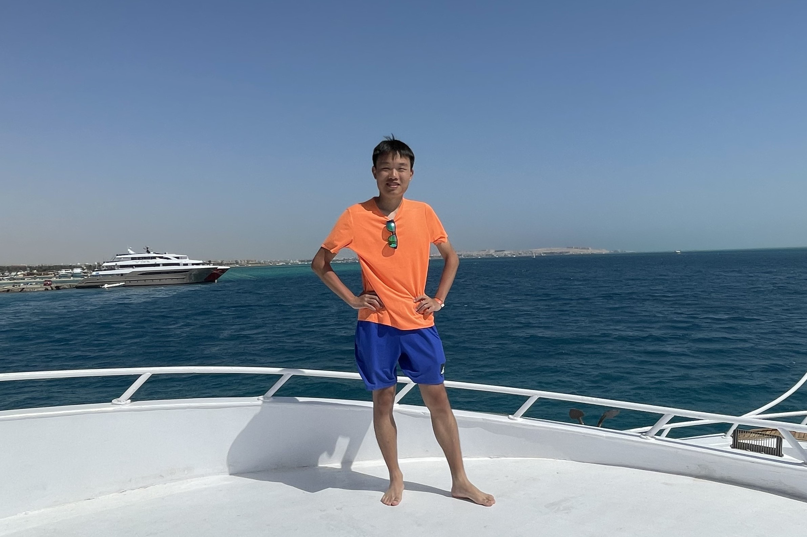

<!-- 主页上只展示客观成果，主观的东西和需要展开讲的东西放到其他页面 -->
<!-- -->
---

# 👨‍🎓About

**Yue Wu** is a 1st-year Ph.D. student in the Division of Applied Mathematics at Brown University. His research interests include Numerical Analysis and Scientific Computing. 

Outside of his academic life, he is an aviation enthusiast and enjoys road cycling and hiking. He grew up in Wuxi, a beautiful city in east China. 

Please find his CV [here](../files/cv.pdf "Yue Wu's CV"){:target="_blank"}. 

# 🎓Education 

- 09/2023 ~ Present: [Division of Applied Mathematics](https://appliedmath.brown.edu/ "APMA, Brown"){:target="_blank"},  [Brown University](https://www.brown.edu/ "Brown"){:target="_blank"} 
    - Ph.D. Student in *Applied Mathematics*
- 09/2019 ~ 06/2023:  [School of the Gifted Young](https://en.scgy.ustc.edu.cn "SCGY, USTC"){:target="_blank"},  [University of Science and Technology of China](https://en.ustc.edu.cn "USTC"){:target="_blank"} 
    - B.Sc. in *Information & Computational Science* 
    - GPA: 3.96/4.30 (91.77/100.00), rank 1st/40 in the major 
- 09/2017 ~ 06/2019:  Wuxi No. 1 High School 

# 📃Preprints 

- **Yue Wu** and Yan Xu, "A high-order local discontinuous Galerkin method for the *p*-Laplace equation" (special issue in honor of Chi-Wang Shu's 65th birthday), submitted to *Beijing Journal of Pure and Applied Mathematics*, Nov. 2023. [arXiv:2311.09119](https://arxiv.org/abs/2311.09119 "arXiv link"){:target="_blank"}. 

# 🏅Honors and Awards

- AY 2023-2024: Howard and Jan Swearer Graduate Fellowship 
- 06/2023: USTC Outstanding Undergraduate Award 
- 06/2023: "Chia-Chiao Lin" Gold Medal (Top 1 in China), the 14th S.-T. Yau College Student Math Contest, Applied and Computational Math track 
- 06/2023: Team Silver Medal, the 14th S.-T. Yau College Student Math Contest, team competition track 
- 06/2023: Excellence Prize, the 14th S.-T. Yau College Student Math Contest, Analysis and PDEs track 
- 10/2022: Gold Prize, USTC Outstanding Student Scholarship 
- 08/2022: Excellence Prize, the 13th S.-T. Yau College Student Math Contest, Analysis and PDEs track 
- 12/2021: China National Scholarship 
- 12/2021: Second Prize, the 13th Chinese Math Competitions 
- 12/2020: China National Scholarship 
- 09/2019: Third Prize, USTC Freshman Scholarship 

# 🙋‍♂️Teaching Experiences 

- Spring 2022 at USTC: Undergraduate Teaching Assistant, Computational Methods B (Instructor: [Prof. Jingrun CHEN](https://faculty.ustc.edu.cn/chenjingrun/en/index/601834/list/index.htm "Prof. Jingrun CHEN's homepage"){:target="_blank"}). 

# 🔧Skills

- Programming: C/C++, Matlab, Fortran 95/2003, Python, LaTeX 
- Parallel computing: MPI, OpenMP, Coarray Fortran 
- Languages: (Mandarin) Chinese, English 

<!-- Explanation for abbreviations -->

*[USTC]: University of Science and Technology of China 
*[SCGY]: School of the Gifted Young 

---

# 📫 Contact

<address>
Yue Wu  
Division of Applied Mathematics  
Brown University  
Box F  
Providence, RI 02912-9106 
</address>

---

# 📷Gallery

    
    
    
     
    
    
    
    
 

---

