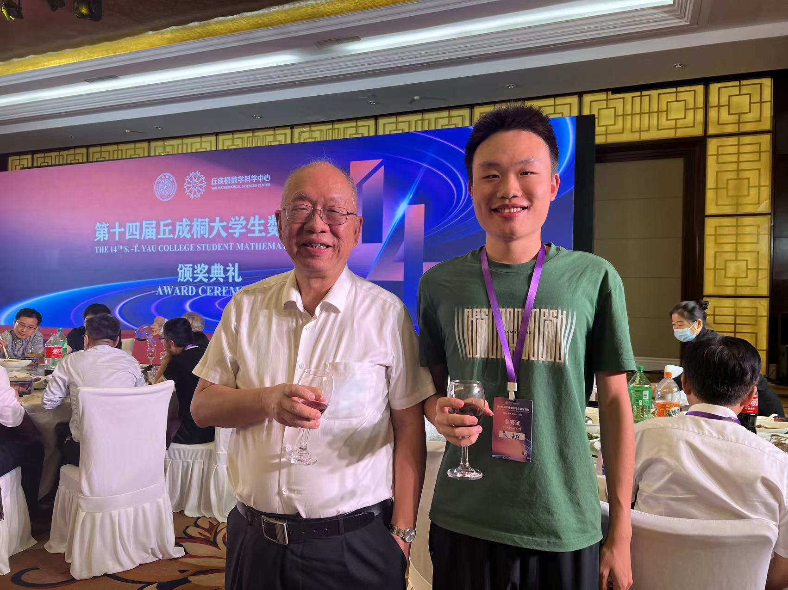

Files
===

My lecture notes (in Chinese) of *Differential Equations I* (ODEs and basic PDEs) can be viewed [here](../files/note1.pdf){:target="_blank"}. 

Implementation and test results of FD-WENO schemes (in Chinese) can be viewed [here](../files/demo1.pdf){:target="_blank"}. 

FEM homework reports can be found [HW1](../files/FEM/HW1.pdf) (1D linear element){:target="_blank"}, [HW2](../files/FEM/HW2.pdf){:target="_blank"} (1D quadratic element), [HW3](../files/FEM/HW3.pdf){:target="_blank"} (1D purely Neumann BC), [HW4](../files/FEM/HW4.pdf){:target="_blank"} (2D linear element), [HW5](../files/FEM/HW5.pdf){:target="_blank"} (2D quadratic element). 

Links
===

* USTC: [en.ustc.edu.cn](https://en.ustc.edu.cn){:target="_blank"} 
* SCGY, USTC: [en.scgy.ustc.edu.cn](https://en.scgy.ustc.edu.cn){:target="_blank"} 
* Math, USTC: [math.ustc.edu.cn](http://math.ustc.edu.cn/ENGLISH/list.htm){:target="_blank"} 
* LibGen: [libgen.gs](https://libgen.gs){:target="_blank"} 
* iCourse Club, USTC: [icourse.club](https://icourse.club){:target="_blank"} 
* Intel OneAPI Toolkits: [OneAPI](https://www.intel.com/content/www/us/en/developer/tools/oneapi/toolkits.html){:target="_blank"} 
* S.-T. Yau College Student Mathematics Contest: [Yau-Contest](http://yau-contest.com/en){:target="_blank"} 
* Warming Math Magazine (USTC Math Department): [Warming](http://staff.ustc.edu.cn/~mathsu01/pu/waming.html){:target="_blank"} 
* AcademicPages (template for this website): [academicpages](https://github.com/academicpages/){:target="_blank"} 
* VSCode portable: [VSCode portable](https://code.visualstudio.com/docs/editor/portable){:target="_blank"} 
* [How to use `ifort` + `IntelMPI`/`coarray` on Windows or Linux clusters](https://blog.csdn.net/PilotJohnWu/article/details/121064266){:target="_blank"} 

Pictures
===

    
     
    

        Photo with Prof. Shing-Tung Yau, at the award ceremony of the 14th S.-T. Yau College Student Math Contest, in which I won a gold and a silver medal. 
    

    
 

