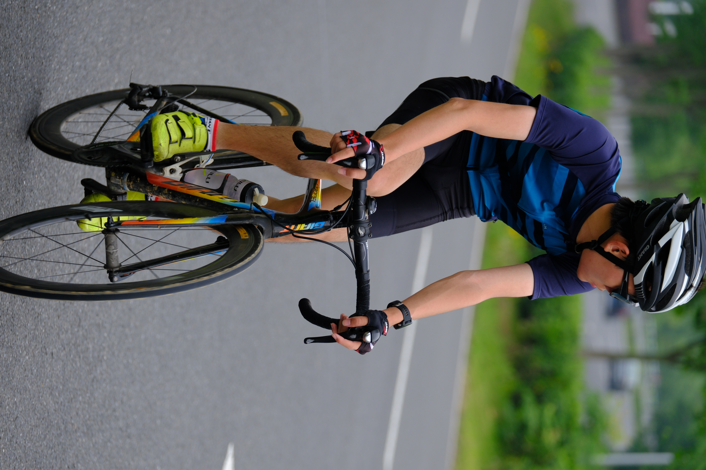
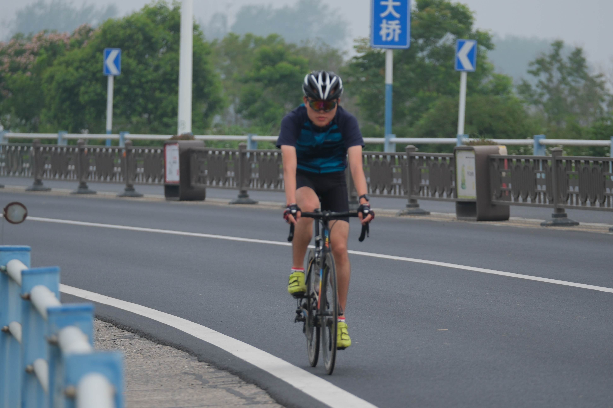
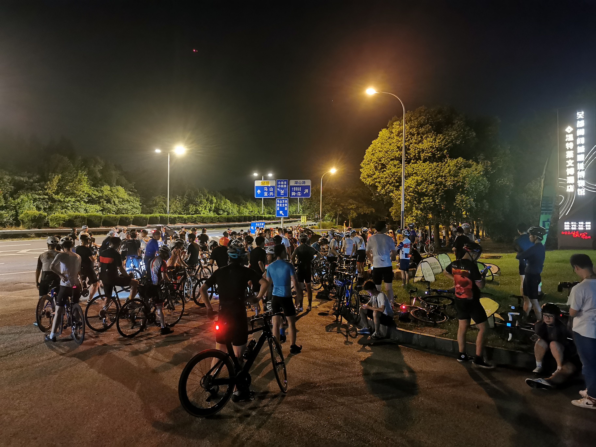
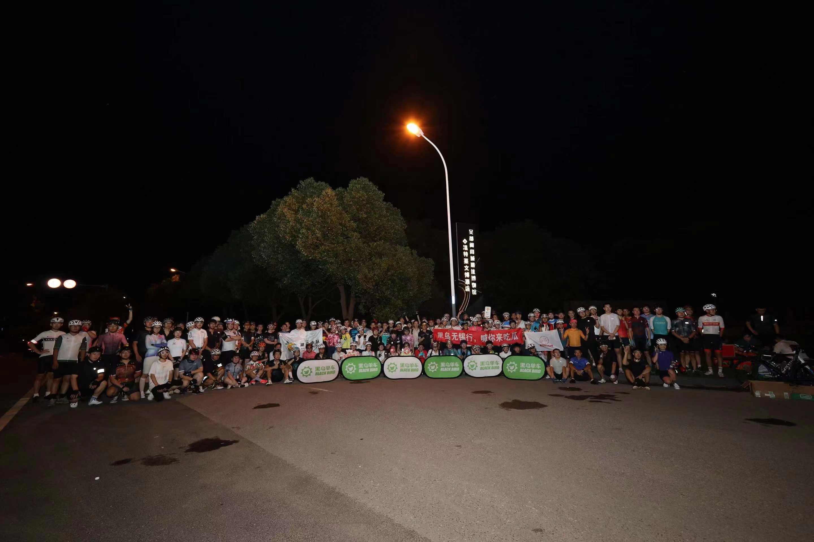

<!-- 如果要设置图片大小什么的，尽量去设置宽度而不是高度，因为你设置的高度会被CSS的 height: auto 覆盖掉；但是设置 width=60% 会导致编译失败，一定要写 width="60%" -->

---

# 🚴‍♂️Photos 

    
     
    

        with the local cycling clubs, on Road S230 in Wuxi, summer 2019
    

    
 

    
     
    

        with the local cycling clubs, at the <a href = "https://en.hlcruinspark.com/">Helv City Relics</a>, Wuxi, summer 2019
    

    
 

    
     
    

        with the local cycling clubs, at the Mt. Lingshan Scenic Area, Wuxi, summer 2019
    

    
 

    
     
    

        my bicycle on the top of the Sanmao Peak, Wuxi, summer 2019
    

    
 

    
     
    

        my bicycle at the riverside in Thirty-Peak agricultural region, Hefei, March 2022
    

    
 

    
     
    

        getting ready to ride
    

    
 

    
     
    

        USTC cycling club
    

    
 

    
     
    

        my aerobike at the school gate
    

    
 

    
     
    

        a chicken guarding our bikes
    

    
 

    
     
    

        at the Sanhe Ancient Town, Nov. 2022
    

    
 

    
    
     
    
    
     
    

        riding by the Chaohu Lake at a local club event, Mar. 2023
    

    
 

    
    
     
    

        local cycling club event (more than 100 people), Aug. 2023
    

    
 

